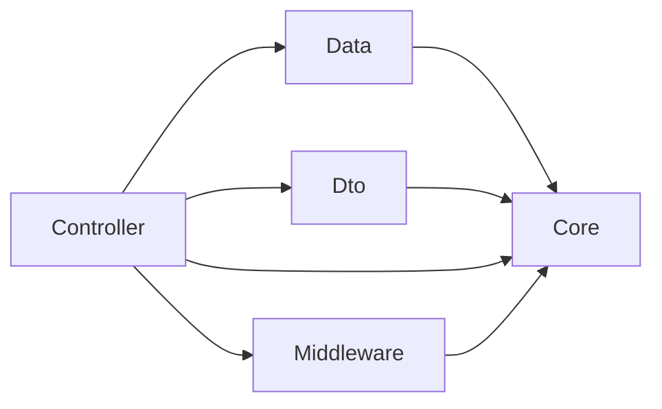

# À propos de l'API web Gallium+

## Présentation

Gallium+ est la version 2 de Gallium, un logiciel de vente développé en 2020 par
des étudiants de l'IUT de Dijon. Vers la fin de l'année scolaire 2021-2022,
d'autres étudiants ont pris l'initiative de créer une nouvelle version du
logiciel pour pallier à certains défaut de l'original, ajouter de nouvelles
fonctionnalités et la rendre plus maintenable pour éviter qu'une nouvelle
application soit créée chaque année. Une des amélioration était de passer par
un service web pour la persistence des données: *l'API web Gallium+*.

## Structure du projet

### Solution Visual Studio

La solution est décomposée en trois projets : Core, FakeDatabase et Service.
Core contient les classes métier et les interfaces des DAOs. FakeDatabase est
une implémentation des DAOs basée sur des dictionnaires, utile pour les tests
unitaires. Service est le projet ASP.NET et contient les contrôleurs, les DTOs
et le middleware.

### Espaces de noms

Le projet utilise `GalliumPlus.WebApi` comme espace de noms de base.
L'application est alors découpée en cinq espaces de noms: `Core` rassemble le
code métier et les interfaces des DAOs, `Data` contient les implémentations des
DAOs, `Controllers` contient les différents contrôleurs, `Dto` contient les DTOs
et leurs Mappers, et `Middleware` contient le middleware (authentification,
autorisation, gestion d'erreurs, ...).

### Architecture logicielle

Le projet utilise une architecture MVC: `Core` et `Data` forment le *Modèle*,
`Dto` fait office de *Vue*, et `Controllers` est la partie *Contrôleur*.

Il n'y a pas de « vue » à proprement parler, car cette partie est gérée par le framework.

### Diagramme de paquets

